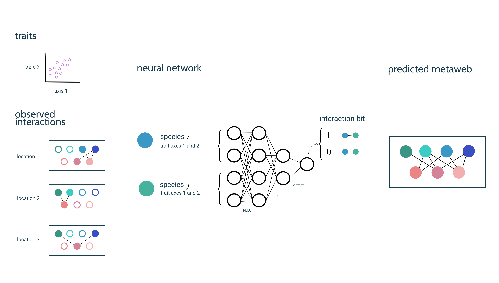
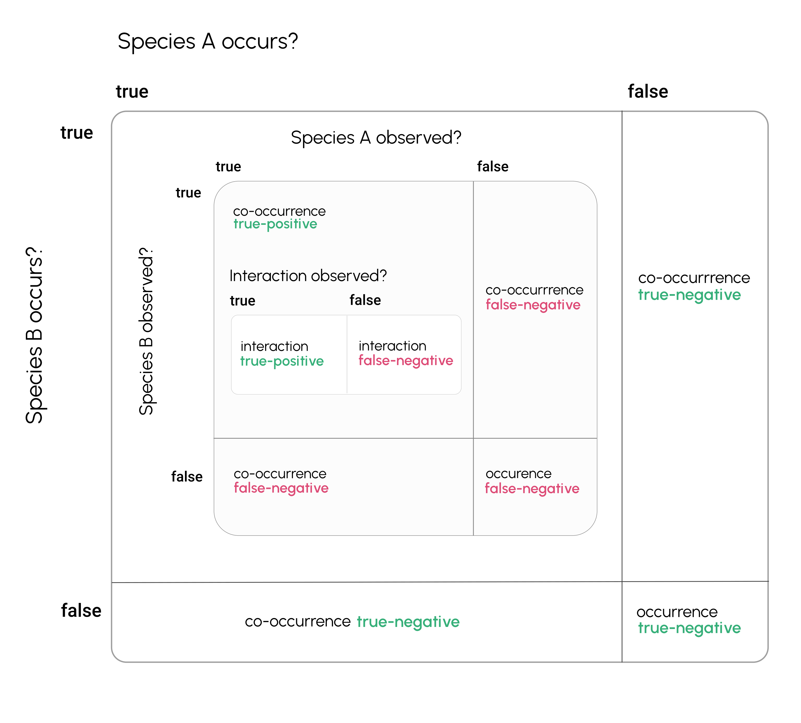
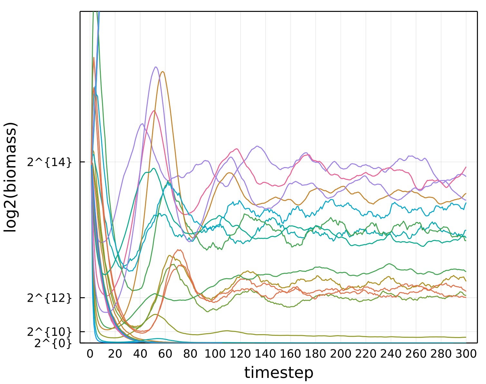

# Summary

This is the annual report for my second committee meeting on September
22, 2021. This document includes a brief introduction to the topic of
my thesis, an updated outline of each chapter, what progress had been
made on these chapters in the previous year, and a timeline for the
next year of work. Additionally, as in the last month the research
committee has discussed a revised time-frame and restructure for my
PhD, which here I propose a timetable to finish by Fall 2023.

# Introduction

Developing a predictive theory of ecology is an imperative, both for our
understanding of ecosystem function but also because of the applied need to make
robust, actionable forecasts of how ecosystem composition and function will
change in the future [@Dietze2018IteNea; @Dietze2017PreEco]---(fig. 1).
Effective prediction has long evaded ecological systems as they are variable,
high-dimensional, and the intrinsic dynamics that govern are system are unknown
[@Chen2019RevCom]. Further the spatiotemporal scale and resolution of a model
effects the intrinsic predictability of ecological dynamics
[@Pennekamp2019IntPre]. A primary theme of my proposed dissertation is
understanding how simulation tools and methods can aid prediction and
forecasting  in ecology, much in the way simulated has aided other fields which
aim to tackle similarly complex systems.

{#fig:predictive}

In particular, the first two chapters discuss use of simulation for sampling,
understanding and predicting interactions between species
(fig. 2). The third chapter then shifts to apply simulation
methods in landscape ecology to optimize corridor placement with respect to a
given ecosystem function. The fourth and final chapter is the software
(_MetacommunityDynamics.jl_) which enables the rest of the dissertation.

{#fig:networkprediction}

# Dissertation status

This section briefly describes the status of each chapter, how the structure has
changed in the last year. During last years committee meeting, it was suggested
that the first chapter be a full review of the spatial/temporal/taxonomic scale
at which empirical data on ecological networks exists. In the year since, a
couple of papers have effectively done this [@Guimaraes2020StrEco ;
@Resasco2021PlaPol; @Schwarz2020TemSca].

The second change is relating to the structure and timeline of the PhD.
Initially my proposed dissertation was aimed at building the foundations for a
research program which could be competitive for faculty positions. As a
collective decision the committee that decided based on my adjusted career
interests post-PhD (ideally a semi-permanent data-science/research position at a
government sector), the goal is now narrow the scope of the PhD to finish before
September 2023, in addition to highlighting the applied potential of my work
(primarily in chapter three).

Here I briefly summarize the goal of each chapter and describe in-progress work.

## Dissertation Introduction

This is a general introduction to the topics in the dissertation: roughly a
2,000 word history of community ecology, metacommunities, theory and simulation
in ecology, and so on. At the moment I have about 1200 words on this, which will
likely be adapted into part of the dissertation proposal for my qualifying
exams.

## Chapter one (_The missing link: differentiating true from false negatives when sampling species interactions_)

The first chapter is a vignette of how simulation can have pragmatic use in
ecology, specifically for guiding sampling of interaction based on neutral
probabilities of observing interactions due to relative abundance. This is now a
paper that we are (hopefully) close to preprinting and submitting, and as a
result I won't go too far into the details here.

It begins with a conceptual framework for understanding the difference in
false-negatives in occurrence, co-occurrence, and interactions (fig. 3).
We use a null model of the relative-abundance distribution [@Hubbell2001UniNeu] to
simulate realized false-negatives as a function of varying sampling effort.

{#fig:taxonomy}

This also goes on to includes testing some assumptions of the model with
empirical data (fig. 4), which indicate our neutral model, if
anything, underestimates the probability of false-negatives due to positive
correlations in co-occurrence in two spatially replicated networks
[@Hadfield2014TalTwo; @Thompson2000ResSol].

{#fig:assoications}

This chapter concludes with a discussion how argument null models, like those
presented, in order to plan sampling effort across space and derive estimates of
the probability of incorrect interaction detection (which can be implemented
into predictive models [@Joseph2020NeuHie]).

## Chapter two (_Generative learning for predictive ecology_)

This chapter further addresses the need to predict interactions between species.
As species interaction data is limited (for the reasons explored in the previous
chapter) this has limited the models we can use for interaction prediction, as
many models we would like to use (e.g. deep neural-nets) require large amounts
of data. The central idea of this chapter is that predictive models can be
trained on primarily (or entirely) simulated data and still can be used to
effectively predict interactions in empirical data (fig. 5).

{#fig:generative}

Many generative models have been proposed to explain food-web structure which
fit data reasonably well [@cascade; @Williams2000SimRul; @Allesina2008]. The
idea for this chapter is to train a neural network to predict interactions (a la
[@Strydom2021RoaPre]) on simulated data from each of these generative food web
models. As this predicted model uses inputs for each species
(fig. 2), to train this model on generated food-webs, we need
summary statistics to go from the network to species-level features. In some
code thus far I've considered: trophic level, degree, omnivory index, generality
index, centrality, position in left subspace of SVD [@transferlearning], and in the
future I plan to testing various combinations.

The future work here is drafting some results figures, with a complete first draft
done by March 2022.

## Chapter three (_Optimizing corridor placement to minimize extinction probability_)

Promoting landscape connectivity is important to mitigate the effects of
land-use change on Earth's biodiversity. However, the practical realities of
conservation mean that there is a limitation on how much we can modify
landscapes in order to do this. So what is the best place to put a corridor
given a constraint on how much surface-area you can change in a landscape? This
is the question this chapter seeks to answer. Models for proposing corridor
locations have been developed, but are limited in that are not developed around
promoting some element of ecosystem function, but instead by trying to find the
path of least resistance given a resistance surface [@Peterman2018ResRP].

This chapter proposes a general algorithm for optimizing corridor placement
based on a measurement of ecosystem functioning derived from simulations run on
a proposed landscape modification. We propose various landscape modifications
which alter the cover of a landscape, represented as a raster
(fig. 6, left). We then compute a new resistance surface based on
the proposed landscape modification, and based on the values of resistance to
dispersal between each location we simulate spatially-explicit metapopulation
dynamics model [@Ovaskainen2002MetMod; @Hanski2000MetCap] to estimate a
distribution of time until extinction for each landscape modification
(fig. 6, right).

{#fig:corridorspace}

We denote the space of landscape modifications $M_B$, given you have a budget of
$B$ cells in the raster which you can change (to the minimum value of resistance
across all cells). This space of possible modifications is big--- if we fix $B$ as
a proportion of the total size of the lattice, it's NP-complete with respect to
lattice size. We propose a simulated-annealing algorithm to estimate the optimal
landscape modification. Simulated annealing works by defining a Markov-chain
$\vec{\pi} = [\pi_1, \pi_2, \dots, \pi_N]$ which has an associated temperature
parameter $\alpha$, where each item in the chain is a proposed landscape
modification $\pi_i \in M_B$. For each step

$$ \pi_{i+1} = \begin{cases} q(\pi_i, x) \\ \pi_i \end{cases} $$

where $q(x,y)$ is a function that describes the probability of transitioning
from state $x$.

The practical difficulties in implement this here are two-fold. 1) Defining a
transition probability function $q$, and 2) defining a proposal algorithm.
First, to describe a transition probability function $q(x,y)$, which gives the
probability that a chain $\pi$ will move from modification $x$ to modification $y$ at a given step,
we consider a logistic function

$$q(x,y) = \frac{1}{1 + e^{-\alpha f(x,y)}}$$

where $f(x,y)$ is then a function to measure the distance between two candidate
modifications $x$ and $y$. A simple way of defining $f$ would be the difference
of the mean extinction time for each modification (@fig:corridorspace right),
i.e. $f(x,y) = MTE(y) - MTE(x)$.

In the next year I plan to implement this algorithm and start testing summary
stats and chain temperatures. The goal for the first draft of this chapter is
November 2022.

## Chapter four (_MetacommunityDynamics.jl: a virtual laboratory for community ecology_)

This chapter is the software (_MetacommunityDynamics.jl_) which enables
simulation for the previous four chapters. In the end this will hopefully be
published as a series of case-studies which use the software, although this may
not be finished by the end of my PhD.

The case studies are: 1) occupancy dynamics, 2) food-web dynamics, 3) evolution
of plant-pollinator network. The functionality required by the occupancy dynamics case-study
will be required for the previous chapter (and already is mostly complete), and the food-web
case-study is already nearly functional (fig. 7)

{#fig:foodwebdynamics}

## Dissertation Conclusion

The conclusion of the dissertation will be composed of ~3000 words, composed of
a summary of the dissertation, how it fits into the larger context of ecological
research, and future directions for this work.

# Time-table

> You wait for darkness,
> \
> then you wait for day.
>
>
> You wait for August,
> \
> then you wait for May.
>
> _Built to Spill_

After discussions at the end of summer 2021, my committee agreed that it makes
sense for my career interests to aim to complete the remainder of the PhD in
the next two years.

\begin{table}[H]
\begin{tabular}{|l|l|l|l|l|}
\hline
Month          & Exams        & Drafts      & Submissions   & Courses                   \\ \hline
October 2021   &              &             &               &                           \\ \hline
November 2021  &              &             & CH1 Submitted &                           \\ \hline
December 2021  & Quals        &             &               &                           \\ \hline
January 2022   &              &             &               &                           \\ \hline
February 2022  &              &             &               &                           \\ \hline
March 2022     &              & CH2 Draft 1 &               &                           \\ \hline
April 2022     &              &             &               &                           \\ \hline
May 2022       &              &             &               &                           \\ \hline
June 2022      &              & CH2 Draft 2 &               & Bios2 summer school (3cr) \\ \hline
July 2022      &              &             &               &                           \\ \hline
August 2022    &              &             & CH2 Submitted &                           \\ \hline
September 2022 &              &             &               & Fall 2022 course (3cr)    \\ \hline
October 2022   &              &             &               &                           \\ \hline
November 2022  &              & CH3 Draft 1 &               &                           \\ \hline
December 2022  &              &             &               &                           \\ \hline
January 2023   &              &             &               &                           \\ \hline
February 2023  &              & CH3 Draft 2 &               &                           \\ \hline
March 2023     &              &             &               &                           \\ \hline
April 2023     &              &             & CH3 Submitted &                           \\ \hline
May 2023       & Exit Seminar &             &               &                           \\ \hline
June 2023      &              &             &               &                           \\ \hline
July 2023      &              &             &               &                           \\ \hline
August 2023    & Defense      &             &               &                           \\ \hline
\end{tabular}
\end{table}

\clearpage
# References
