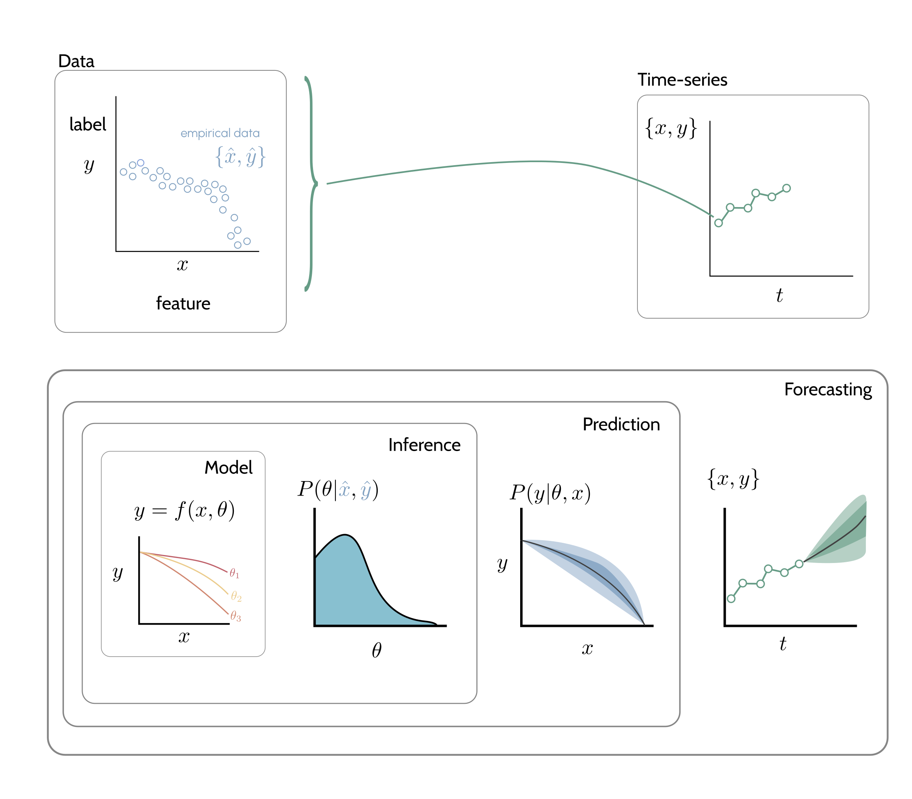
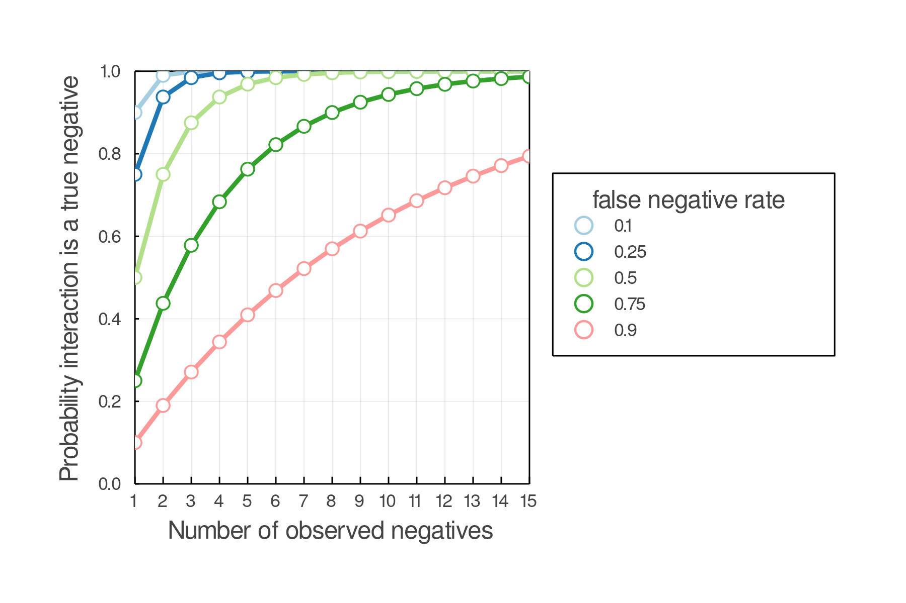
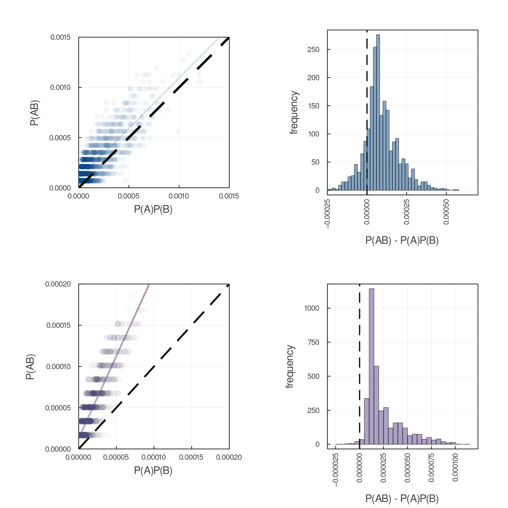
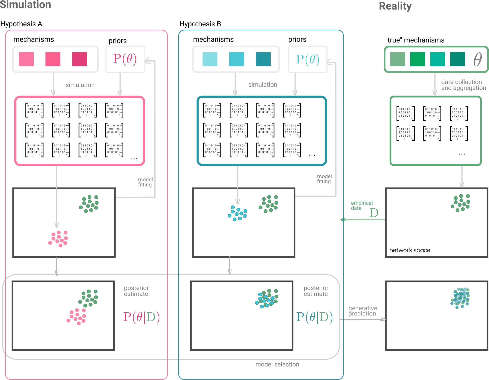
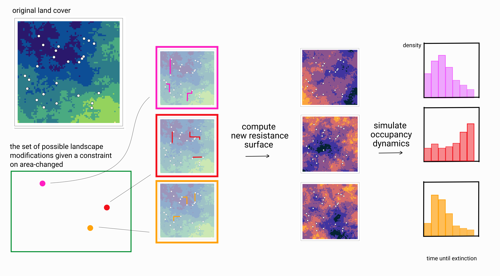

# Summary

This is the annual report for my committee meeting, year two, Sept 22 2021. What
is in this document? A brief recap of the status/outline of each chapter,
timeline for the next year of work, and a prospectus on the next steps re (3rd
meeting/future courses/ta-ing) etc.

# Introduction

Developing a predictive theory of ecology is an imperative, both to root our
understanding of ecosystem function in predictive capacity [@Dietze2017PreEco],
but also because of the applied need to make robust, actionable forecasts of how
ecosystem composition and functioning will change in the future [@Dietze2017].

Effective prediction has long evaded ecological systems as they are variable,
high-dimensional, and the intrinsic dynamics are often unknown
[@SymbolicRegression], and some [@Pennekamp].

Inference and forecasting in ecology. Simulation based inference has proven
effective in the modeling of complex systems (numerical weather prediction; @Num).
Core theme of my dissertation is understanding how simulation tools and methods
can aid predictive ecology.

The purpose of this document is to: briefly outline of each dissertation
chapter, with in-progress work for what's done, goal-figures for what isn't.

One-sentence per chapter here.

Then to present a timetable of work for the next year. A discussion of other
side projects. A discussion of courses and TAing for the next year.

# Dissertation status

## Disseration Introduction

What's the deal with community ecology and global change. Wild stuff.

## Chapter one (_The missing link: differentiating true from false negatives when sampling species interactions_)

This opening chapters serves as a vignette of how simulation can have pragmatic use in ecology.

Include some of the better figs.

## Chapter two (_Generative learning for predictive ecology_)

We need to predict interactions between species.

Data on species interactions is limited. Many conceptual models have been
proposed to explain food-web structure which fit data reasonably well.

Predictive models could feasibly be trained on simulated data to predict
interactions in empirical systems.

In this chapter we (hopefully) show training a model on entirely simulated data can enable
effective prediction of interactions.

## Chapter three (_Optimizing corridor placement_)

Corridors to increase landscape connectivity. In an ideal world we could build
corridors between each pair of locations, but the realities of funding mean we
have a limited amount of Earth's surface for which we can change the surface
cover. So where is the best place to put a corridor given a constraint on how
much area you can change?

## Chapter four ("software chapter.... maybe")

## Disseration Conclusion

Half summary, half future directions for this work

# Time table

Here's

| Month          | Courses     | TAing       | Drafts | Submission |
| -              | -           | -           |- | -           |
| September 2021 |             |             | |             |
| October 2021   |             |             | |             |
| November 2021  |             |             | |             |
| December 2021  |             |             || CH1 Submitted     |
| January 2022   |             | Spring 2021 TA || QUALS       |
| February 2022  |             |             ||             |
| March 2022     |             |             ||             |
| April 2022     |             |             ||             |
| May 2022       |             |             || CH2 Draft 1            |
| June 2022      | BIOS2 summer school (3cr)   |             ||             |
| July 2022      |             |             ||             |
| August 2022    |             |             || CH2 Draft 2            |
| September 2022 |             |             ||             |
| October 2022   |             |             || CH3 Draft 1            |
| November 2022  |             |             ||                        |
| December 2022  |             |             || CH2 Preprint           |
| January 2023   |             |             || CH2 Submitted          |
| February 2023  |             |             ||                        |
| March 2023     |             |             || CH3 Draft 2            |
| April 2023     |             |             ||             |
| May 2023       |             |             || Dissertation Submitted            |

# Additional notes on Phd Stuff

TAing: 2 terms required
Bios2: GEO BON contract
- 6 credits: BIOS2 summer (3 cr),

# Conclusion
